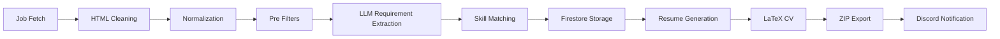

# Job Hunter

<details open>
<summary>🇧🇷 Português</summary>

Pipeline com IA para matching de vagas e geração dinâmica de currículos com base nos requisitos das vagas e nas habilidades do candidato.

</details>

<details>
<summary>🇺🇸 English</summary>

AI-powered pipeline for job matching and dynamic CV generation based on job requirements and candidate skills.

</details>

---

# Visão Geral / Overview

<details open>
<summary>🇧🇷 Português</summary>

Job Hunter é um projeto de portfólio pessoal criado para automatizar parte do fluxo de candidatura a vagas.

Em vez de se candidatar automaticamente, o projeto foca em:

* coletar oportunidades de múltiplas plataformas;
* filtrar vagas com base no perfil do candidato;
* extrair requisitos técnicos utilizando LLMs;
* gerar currículos personalizados para cada vaga;
* criar CVs em LaTeX;
* organizar e ranquear oportunidades.

O projeto foi intencionalmente desenhado para evitar candidaturas automáticas, devido a questões legais e políticas das plataformas.

</details>

<details>
<summary>🇺🇸 English</summary>

Job Hunter is a personal portfolio project designed to automate part of the job application workflow.

Instead of automatically applying to jobs, the project focuses on:

* collecting job opportunities from multiple platforms;
* filtering jobs based on candidate profile;
* extracting technical requirements using LLMs;
* generating customized resumes for each position;
* creating LaTeX-based CVs;
* organizing and ranking opportunities.

The project was intentionally designed to avoid automated applications due to legal and platform policy concerns.

</details>

---

# Funcionalidades Principais / Main Features

## Coleta de Vagas / Job Collection

<details open>
<summary>🇧🇷 Português</summary>

Coleta listagens de vagas de múltiplas fontes:

* Gupy
* Greenhouse
* Nubank Careers
* XP Inc
* BTG Pactual
* B3 Careers

</details>

<details>
<summary>🇺🇸 English</summary>

Collects job listings from multiple sources:

* Gupy
* Greenhouse
* Nubank Careers
* XP Inc
* BTG Pactual
* B3 Careers

</details>

---

## Pipeline de Filtragem / Smart Filtering Pipeline

<details open>
<summary>🇧🇷 Português</summary>

O pipeline filtra vagas utilizando:

* análise de título;
* filtro de localização;
* filtro por palavras-chave;
* tecnologias requeridas;
* anos de experiência;
* skills normalizadas;
* extração de requisitos via LLM.

</details>

<details>
<summary>🇺🇸 English</summary>

The pipeline filters jobs using:

* title analysis;
* location filtering;
* keyword filtering;
* required technologies;
* years of experience;
* normalized skills;
* LLM requirement extraction.

</details>

---

## Extração de Requisitos com IA / AI Requirement Extraction

<details open>
<summary>🇧🇷 Português</summary>

Utiliza modelos da OpenAI para:

* extrair tecnologias das descrições de vagas;
* resumir requisitos;
* identificar skills relevantes;
* enriquecer o matching candidato-vaga.

Modelo atual: **GPT-4.1-mini**

</details>

<details>
<summary>🇺🇸 English</summary>

Uses OpenAI models to:

* extract technologies from job descriptions;
* summarize requirements;
* identify relevant skills;
* enrich candidate-job matching.

Current model: **GPT-4.1-mini**

</details>

---

## Geração Dinâmica de CV / Dynamic CV Generation

<details open>
<summary>🇧🇷 Português</summary>

Gera currículos personalizados com base em:

* projetos do candidato;
* habilidades pessoais;
* experiência profissional;
* requisitos da vaga.

Saídas geradas:

* `.tex`
* `.txt`
* `.zip`

</details>

<details>
<summary>🇺🇸 English</summary>

Generates customized resumes based on:

* candidate projects;
* personal skills;
* professional experience;
* job requirements.

Outputs:

* `.tex`
* `.txt`
* `.zip`

</details>

---

## Integração com Firestore / Firestore Integration

<details open>
<summary>🇧🇷 Português</summary>

Armazena:

* listagens de vagas;
* habilidades do usuário;
* projetos pessoais;
* metadados gerados.

</details>

<details>
<summary>🇺🇸 English</summary>

Stores:

* job listings;
* user skills;
* personal projects;
* generated metadata.

</details>

---

## Notificações via Discord / Planned Discord Notifications

<details open>
<summary>🇧🇷 Português</summary>

Próximo passo:

* notificações automáticas no Discord com vagas processadas e currículos gerados.

</details>

<details>
<summary>🇺🇸 English</summary>

Next step:

* automatic Discord notifications with processed jobs and generated resumes.

</details>

---

# Arquitetura do Pipeline / Pipeline Architecture



---

# Estrutura do Projeto / Project Structure

```text
job-hunter/
├── cv/
├── db/
├── Filter_job/
├── Ia_generative/
├── Job_listing/
├── Jobs/
├── Models/
├── rank_generation/
├── skills/
├── data/
└── main.py
```

<details open>
<summary>🇧🇷 Português</summary>

Conceitos de arquitetura utilizados:

* Programação Orientada a Objetos (POO)
* Princípios SOLID
* Arquitetura em camadas
* Serviços modulares

</details>

<details>
<summary>🇺🇸 English</summary>

Architecture concepts used:

* Object-Oriented Programming (OOP)
* SOLID principles
* Layered architecture
* Modular services

</details>

---

# Stack de Tecnologias / Tech Stack

| Camada / Layer | Tecnologia / Technology |
|---|---|
| Backend | Python |
| IA / AI | OpenAI API — GPT-4.1-mini |
| Banco de Dados / Database | Firebase Firestore |
| Parsing | BeautifulSoup |
| Geração de CV / CV Generation | LaTeX |

---

# Variáveis de Ambiente / Environment Variables

```env
OPENAI_API_KEY=
BOT_TOKEN=
```

---

# Como Executar / Running the Project

```bash
# Instalar dependências / Install dependencies
pip install -r Requirements.txt

# Executar / Run
python main.py
```

---

# Fluxo Atual / Current Workflow

<details open>
<summary>🇧🇷 Português</summary>

1. Buscar listagens de vagas
2. Normalizar dados das vagas
3. Filtrar oportunidades relevantes
4. Extrair requisitos com LLM
5. Remover posições incompatíveis
6. Armazenar vagas no Firestore
7. Gerar currículos contextuais
8. Exportar arquivos LaTeX/TXT/ZIP
9. Preparar notificações no Discord

</details>

<details>
<summary>🇺🇸 English</summary>

1. Fetch job listings
2. Normalize job data
3. Filter relevant opportunities
4. Extract requirements using LLM
5. Remove incompatible positions
6. Store jobs in Firestore
7. Generate contextual resumes
8. Export LaTeX/TXT/ZIP files
9. Prepare Discord notifications

</details>

---

# Melhorias Futuras / Future Improvements

<details open>
<summary>🇧🇷 Português</summary>

* Deploy em nuvem
* Execução agendada
* Integração com Discord
* Dashboard de monitoramento
* Ranqueamento semântico
* Matching baseado em embeddings
* Suporte a banco de dados vetorial
* Analytics para recrutadores
* Pontuação de currículos
* Deploy no GCP Cloud Functions

</details>

<details>
<summary>🇺🇸 English</summary>

* Cloud deployment
* Scheduled execution
* Discord integration
* Dashboard for monitoring
* Semantic ranking
* Embedding-based matching
* Vector database support
* Recruiter analytics
* Resume scoring
* GCP Cloud Functions deployment

</details>

---

# Notas de Deploy / Deployment Notes

<details open>
<summary>🇧🇷 Português</summary>

A ideia original era fazer o deploy usando GCP Cloud Functions com recursos do free tier.

</details>

<details>
<summary>🇺🇸 English</summary>

The original idea was to deploy using GCP Cloud Functions with free tier resources.

</details>

---

# Observações Importantes / Important Notes

<details open>
<summary>🇧🇷 Português</summary>

Este projeto **não realiza candidaturas automáticas**.

A ideia inicial incluía candidaturas automatizadas, mas a direção do projeto mudou devido a:

* questões legais;
* políticas das plataformas;
* considerações éticas sobre automação e scraping.

O foco atual é:

* inteligência sobre vagas;
* filtragem inteligente;
* geração contextual de currículos.

**Ele é personalizado para o usuário, deve haver algumas modificações para poder ser aplicado para outros usuários.**

</details>

<details>
<summary>🇺🇸 English</summary>

This project does NOT perform automatic job applications.

The initial idea included automated applications, but the project direction changed due to:

* legal concerns;
* platform policies;
* ethical considerations regarding automation and scraping.

The current focus is:

* job intelligence;
* smart filtering;
* contextual resume generation.

**It is personalized for the user, some modifications will be required to apply it to other users.**

</details>

---

# Por que este projeto? / Why This Project?

<details open>
<summary>🇧🇷 Português</summary>

O objetivo principal é explorar:

* IA aplicada a fluxos de trabalho reais;
* automação de baixo custo;
* pipelines de processamento escaláveis;
* geração contextual de documentos;
* boas práticas de engenharia de software.

</details>

<details>
<summary>🇺🇸 English</summary>

The main goal is to explore:

* AI applied to real-world workflows;
* low-cost automation;
* scalable processing pipelines;
* contextual document generation;
* software engineering best practices.

</details>

---

# Autor / Author

**Luciano Augusto**

GitHub: [https://github.com/ladcs/job-hunter](https://github.com/ladcs/job-hunter)
