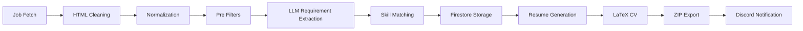

# Job Hunter

AI-powered pipeline for job matching and dynamic CV generation based on job requirements and candidate skills.

> 🇧🇷 Projeto focado em automação de análise de vagas e geração contextual de currículos utilizando IA com baixo custo operacional.
> 🇺🇸 Project focused on job analysis automation and contextual CV generation using low-cost AI pipelines.

---

# Overview

Job Hunter is a personal portfolio project designed to automate part of the job application workflow.

Instead of automatically applying to jobs, the project focuses on:

* collecting job opportunities from multiple platforms;
* filtering jobs based on candidate profile;
* extracting technical requirements using LLMs;
* generating customized resumes for each position;
* creating LaTeX-based CVs;
* organizing and ranking opportunities.

The project was intentionally designed to avoid automated applications due to legal and platform policy concerns.

---

# Main Features

## Job Collection

Collects job listings from multiple sources:

* Gupy
* Greenhouse
* Nubank Careers
* XP Inc
* BTG Pactual
* B3 Careers

---

## Smart Filtering Pipeline

The pipeline filters jobs using:

* title analysis;
* location filtering;
* keyword filtering;
* required technologies;
* years of experience;
* normalized skills;
* LLM requirement extraction.

---

## AI Requirement Extraction

Uses OpenAI models to:

* extract technologies from job descriptions;
* summarize requirements;
* identify relevant skills;
* enrich candidate-job matching.

Current model:

* GPT-4.1-mini

---

## Dynamic CV Generation

Generates customized resumes based on:

* candidate projects;
* personal skills;
* professional experience;
* job requirements.

Outputs:

* `.tex`
* `.txt`
* `.zip`

---

## Firestore Integration

Stores:

* job listings;
* user skills;
* personal projects;
* generated metadata.

---

## Planned Discord Notifications

Next step:

* automatic Discord notifications with processed jobs and generated resumes.

---

# Pipeline Architecture



---

# Project Structure

```text
job-hunter/
├── cv/
├── db/
├── Filter_job/
├── Ia_generative/
├── Job_listing/
├── Jobs/
├── Models/
├── rank_generation/
├── skills/
├── data/
└── main.py
```

Architecture concepts used:

* Object-Oriented Programming (OOP)
* SOLID principles
* Layered architecture
* Modular services

---

# Tech Stack

## Backend

* Python

## AI

* OpenAI API
* GPT-4.1-mini

## Database

* Firebase Firestore

## Parsing / Processing

* BeautifulSoup

## CV Generation

* LaTeX

---

# Environment Variables

```env
OPENAI_API_KEY=
BOT_TOKEN=
```

---

# Running the Project

## Install dependencies

```bash
pip install -r Requirements.txt
```

## Run

```bash
python main.py
```

---

# Current Workflow

1. Fetch job listings
2. Normalize job data
3. Filter relevant opportunities
4. Extract requirements using LLM
5. Remove incompatible positions
6. Store jobs in Firestore
7. Generate contextual resumes
8. Export LaTeX/TXT/ZIP files
9. Prepare Discord notifications

---

# Future Improvements

* Cloud deployment
* Scheduled execution
* Discord integration
* Dashboard for monitoring
* Semantic ranking
* Embedding-based matching
* Vector database support
* Recruiter analytics
* Resume scoring
* GCP Cloud Functions deployment

---

# Deployment Notes

The original idea was to deploy using GCP Cloud Functions with free tier resources.

Alternative recommendations for low-cost deployment:

* Railway
* Render
* Fly.io

For file storage:

* Cloudflare R2

These platforms provide a simpler deployment experience for Python workers and scheduled pipelines.

---

# Important Notes

This project does NOT perform automatic job applications.

The initial idea included automated applications, but the project direction changed due to:

* legal concerns;
* platform policies;
* ethical considerations regarding automation and scraping.

The current focus is:

* job intelligence;
* smart filtering;
* contextual resume generation.

---

# Why This Project?

The main goal is to explore:

* AI applied to real-world workflows;
* low-cost automation;
* scalable processing pipelines;
* contextual document generation;
* software engineering best practices.

---

# Job Hunter

🇧🇷 Plataforma de automação para análise de vagas e geração contextual de currículos utilizando IA.
🇺🇸 AI-powered platform for job analysis automation and contextual resume generation.

---

# 🇧🇷 Sobre o Projeto

O Job Hunter é um projeto pessoal focado em automatizar parte do processo de busca e preparação para vagas de tecnologia.

Ao invés de realizar candidaturas automáticas, o projeto foi direcionado para:

* coleta de vagas;
* filtragem inteligente;
* extração de requisitos utilizando IA;
* geração contextual de currículos;
* matching entre perfil profissional e requisitos da vaga.

O objetivo é reduzir trabalho manual durante candidaturas e gerar currículos mais alinhados com cada oportunidade.

---

# 🇺🇸 About the Project

Job Hunter is a personal project focused on automating parts of the job searching workflow.

Instead of automatically applying to jobs, the project focuses on:

* job collection;
* intelligent filtering;
* AI requirement extraction;
* contextual resume generation;
* candidate-job matching.

The goal is to reduce manual work during applications and generate resumes tailored to each opportunity.

---

# 🇧🇷 Principais Funcionalidades

## Coleta de vagas

Busca vagas em diferentes plataformas:

* Gupy
* Greenhouse
* Nubank Careers
* XP Inc
* BTG Pactual
* B3 Careers

---

## Pipeline de filtragem inteligente

O sistema realiza filtros utilizando:

* análise de título;
* localização;
* palavras-chave;
* tecnologias obrigatórias;
* anos de experiência;
* normalização de skills;
* extração de requisitos via LLM.

---

## Extração de requisitos com IA

Utiliza OpenAI para:

* extrair tecnologias da vaga;
* resumir requisitos;
* enriquecer matching;
* identificar habilidades relevantes.

Modelo atual:

* GPT-4.1-mini

---

## Geração dinâmica de currículo

Gera currículos personalizados utilizando:

* projetos pessoais;
* experiências profissionais;
* skills cadastradas;
* requisitos da vaga.

Arquivos gerados:

* `.tex`
* `.txt`
* `.zip`

---

## Integração com Firestore

Armazena:

* vagas;
* skills;
* projetos;
* metadados gerados.

---

## Integração com Discord (em desenvolvimento)

Próximo passo:

* envio automático de notificações via Discord.

---

# 🇺🇸 Main Features

## Job Collection

Collects job listings from multiple sources:

* Gupy
* Greenhouse
* Nubank Careers
* XP Inc
* BTG Pactual
* B3 Careers

---

## Smart Filtering Pipeline

The pipeline filters jobs using:

* title analysis;
* location filtering;
* keyword filtering;
* required technologies;
* years of experience;
* normalized skills;
* LLM requirement extraction.

---

## AI Requirement Extraction

Uses OpenAI models to:

* extract technologies from job descriptions;
* summarize requirements;
* identify relevant skills;
* enrich candidate-job matching.

Current model:

* GPT-4.1-mini

---

## Dynamic Resume Generation

Generates customized resumes based on:

* candidate projects;
* professional experience;
* personal skills;
* job requirements.

Outputs:

* `.tex`
* `.txt`
* `.zip`

---

## Firestore Integration

Stores:

* job listings;
* user skills;
* personal projects;
* generated metadata.

---

## Discord Notifications (planned)

Next step:

* automatic Discord notifications with processed jobs and generated resumes.

---

# Arquitetura / Architecture


---

# Estrutura do Projeto / Project Structure

```text id="mjlwmf"
job-hunter/
├── cv/
├── db/
├── Filter_job/
├── Ia_generative/
├── Job_listing/
├── Jobs/
├── Models/
├── rank_generation/
├── skills/
├── data/
└── main.py
```

Conceitos utilizados:

* Object-Oriented Programming (OOP)
* SOLID
* Arquitetura em camadas
* Modularização de serviços

---

# Stack Tecnológica / Tech Stack

## Backend

* Python

## IA / AI

* OpenAI API
* GPT-4.1-mini

## Banco de Dados / Database

* Firebase Firestore

## Parsing

* BeautifulSoup

## Geração de Currículo / Resume Generation

* LaTeX

---

# Variáveis de Ambiente / Environment Variables

```env id="67wfxq"
OPENAI_API_KEY=
BOT_TOKEN=
```

---

# Execução / Running the Project

## Instalação

```bash id="m4ewqy"
pip install -r Requirements.txt
```

## Execução

```bash id="rf6qut"
python main.py
```

---

# Fluxo Atual / Current Workflow

1. Busca vagas
2. Normaliza dados
3. Filtra oportunidades
4. Extrai requisitos via IA
5. Remove vagas incompatíveis
6. Salva no Firestore
7. Gera currículos contextualizados
8. Exporta arquivos LaTeX/TXT/ZIP
9. Prepara notificações no Discord

---

# Próximos Passos / Future Improvements

* Deploy em cloud
* Execução agendada
* Dashboard web
* Integração completa com Discord
* Matching semântico
* Embeddings
* Banco vetorial
* Score de compatibilidade
* Deploy via GCP Cloud Functions
* Painel de monitoramento

---

# Observações Importantes / Important Notes

O projeto NÃO realiza candidaturas automáticas.

A ideia inicial incluía automação de candidatura, porém o direcionamento mudou devido a:

* questões legais;
* políticas das plataformas;
* preocupações éticas envolvendo automação e scraping.

O foco atual é:

* inteligência de vagas;
* filtragem inteligente;
* geração contextual de currículos.

---

# Deploy e Cloud

A ideia inicial era utilizar GCP Cloud Functions utilizando free tier.

Alternativas recomendadas para deploy de baixo custo:

* Railway
* Render
* Fly.io

Para armazenamento de arquivos:

* Cloudflare R2

Essas plataformas simplificam deploy de pipelines Python e execução agendada.

---

# Objetivo do Projeto / Project Goal

Explorar:

* IA aplicada em problemas reais;
* automação de baixo custo;
* pipelines escaláveis;
* geração contextual de documentos;
* boas práticas de engenharia de software.

---

# Author

Luciano Augusto

GitHub:
https://github.com/ladcs/job-hunter
